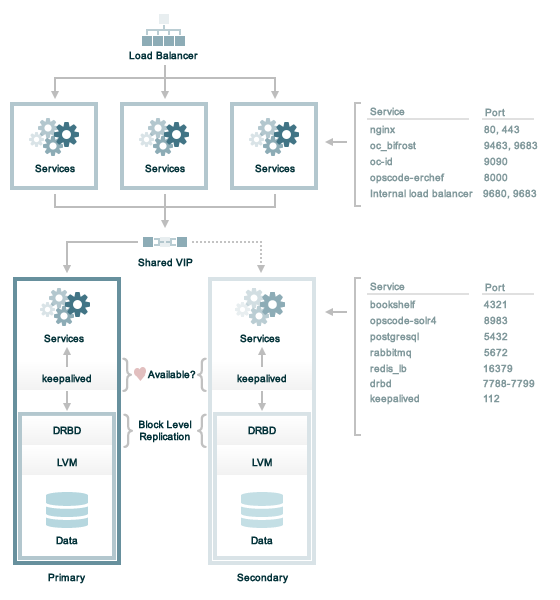
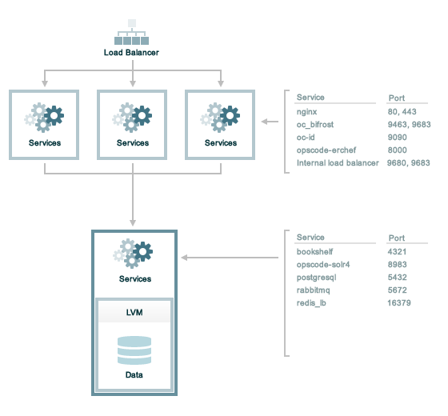

.. THIS PAGE DOCUMENTS Chef server version 12.0

=====================================================
Firewalls and Ports
=====================================================

.. include:: ../../includes_server_firewalls_and_ports/includes_server_firewalls_and_ports.rst

.. include:: ../../includes_server_firewalls_and_ports/includes_server_firewalls_and_ports_listening.rst

.. note:: .. include:: ../../includes_server_firewalls_and_ports/includes_server_firewalls_and_ports_external_vs_internal.rst

Standalone
=====================================================
The following sections describe the ports that are required by the Chef server in a standalone configuration:

.. image:: ../../images/chef_server_ports_standalone.png

.. include:: ../../includes_server_firewalls_and_ports/includes_server_firewalls_and_ports_loopback.rst

.. include:: ../../includes_server_firewalls_and_ports/includes_server_firewalls_and_ports_standalone.rst

High Availability
=====================================================
The following sections describe the ports that are required by the Chef server in a high availability configuration that is running DRBD and Keepalived to manage the active/passive backend servers:

.. include:: ../../includes_server_firewalls_and_ports/includes_server_firewalls_and_ports_loopback.rst

Front End
-----------------------------------------------------
.. include:: ../../includes_server_firewalls_and_ports/includes_server_firewalls_and_ports_fe.rst

Back End
-----------------------------------------------------
.. include:: ../../includes_server_firewalls_and_ports/includes_server_firewalls_and_ports_12-2_be.rst

Tiered
=====================================================
The following sections describe the ports that are required by the Chef server in a tiered configuration:

.. include:: ../../includes_server_firewalls_and_ports/includes_server_firewalls_and_ports_loopback.rst

Front End
-----------------------------------------------------
.. include:: ../../includes_server_firewalls_and_ports/includes_server_firewalls_and_ports_fe.rst

Back End
-----------------------------------------------------
.. include:: ../../includes_server_firewalls_and_ports/includes_server_firewalls_and_ports_12-2_tiered.rst

Chef Analytics
=====================================================
The following sections describe the ports that are required by Chef Analytics:

.. include:: ../../includes_server_firewalls_and_ports/includes_server_firewalls_and_ports_analytics.rst

Chef Push Jobs
=====================================================
.. include:: ../../includes_server_firewalls_and_ports/includes_server_firewalls_and_ports_push_jobs.rst
