# Overview

About Azure Marketplace

The Azure Marketplace image deploys Chef Automate and Chef Infrastructure Server on a shared instance that can be used with [Chef Workstation](https://docs.chef.io/workstation/) tools like `chef`, `knife`, `inspec` and `hab`. The Chef Automate stack provides the dashboard, data aggregation, and analytics layer for all Chef products.

In case you have a need of running automate in HA mode, please contact [Chef Support](https://www.chef.io/support).

please contact [Chef Support](https://www.chef.io/support).


# Test drive Deployment

- **Go to [Azure Marketplace](https://azure.microsoft.com/en-in/marketplace/) and search for this keyword `Chef Automate`** 

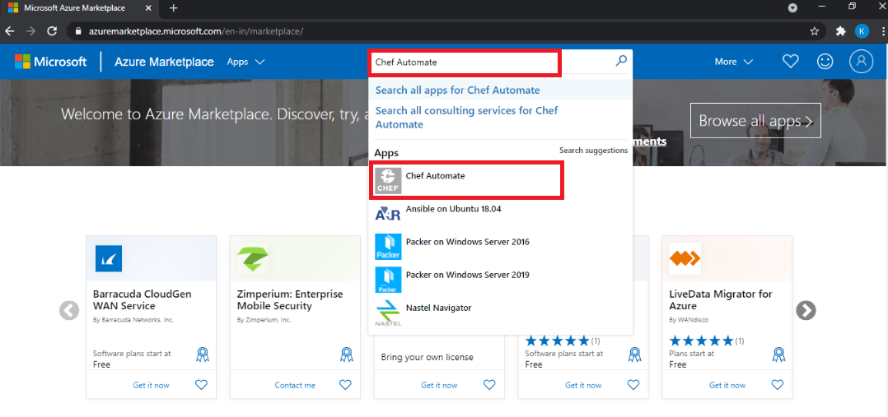

- **Click on `Get it Now` button as show below**

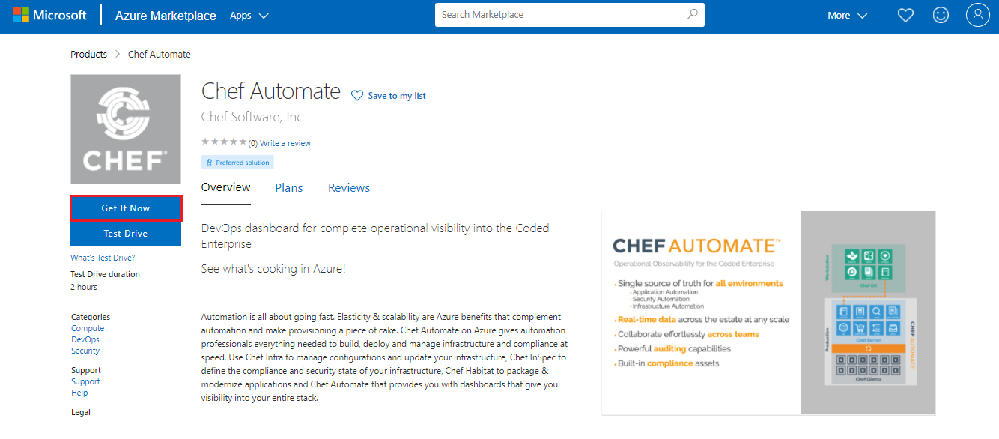

- **Sign in to Microsoft account with a valid `Azure portal email` address**

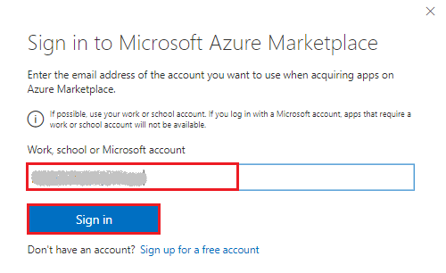

- **It will prompt you to login page, enter password and click on sign in**

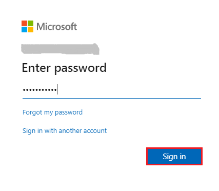

- **Click on continue as shown below**

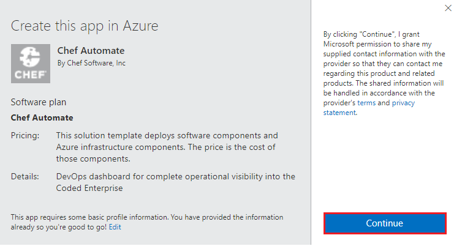

- **Click on create** 

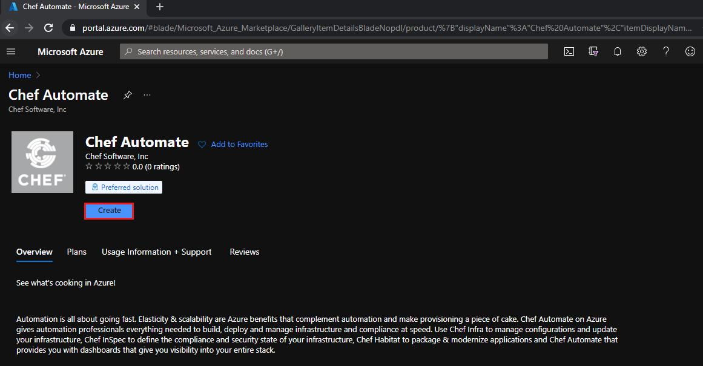

- **Provide the required details as shown below and click on Next**

    - **`Subscription`: Select the required subscription**

    - **`Resource group`: Create new or Select existing one** 

    - **`Region`: Select the required region**

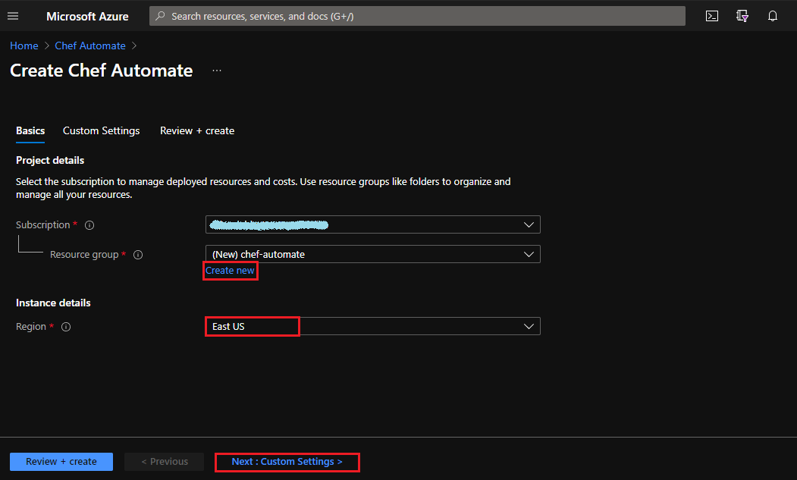

- **Fill the custom settings and click on Next**

    - **`Username`: <Anyname> Eg:`chefuser`**

    - **`SSH public key`: use your existing or new public key**

    - **`Size`: Select the size based on requirement Eg:`Standard D4s v3`**

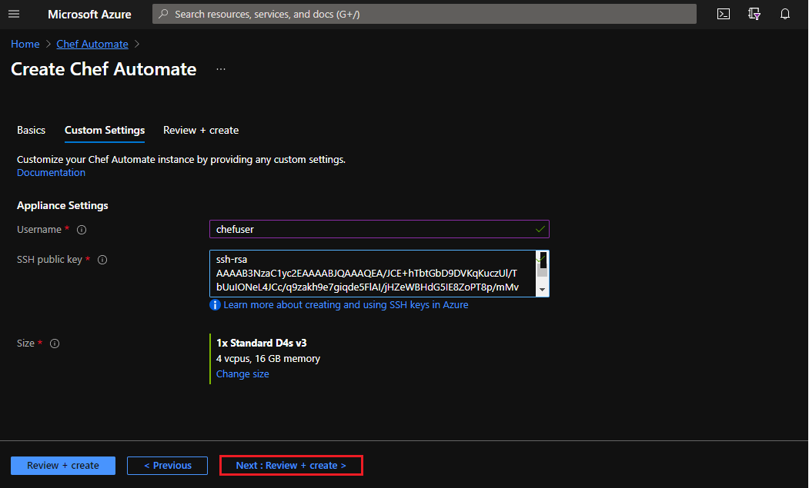

- **Review it once and click on create to start deployment**

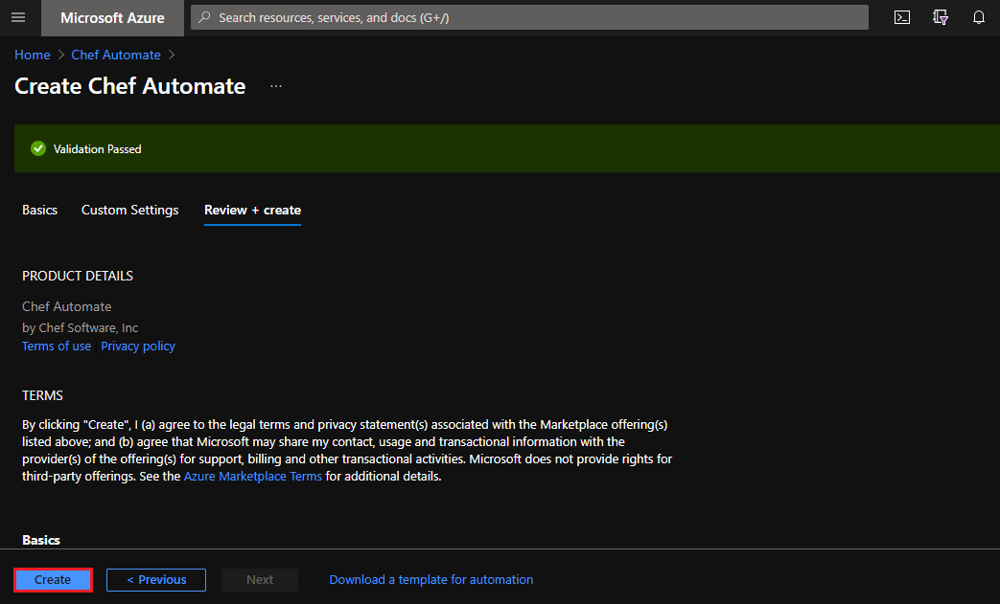

- **Chef Automate deployment is in progress it tooks around `15 min` to complete deployment**

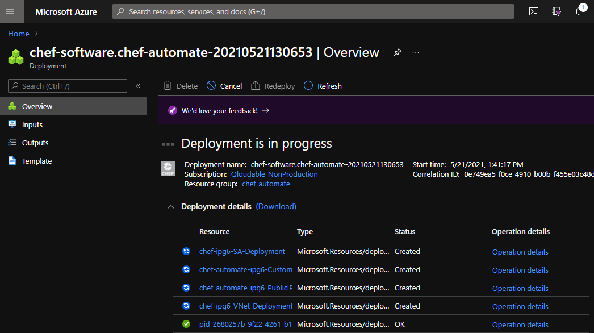

- **Click on Go to resource group**

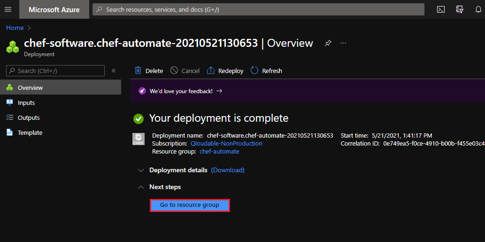

- **Open Chef Automate Virtual machine**

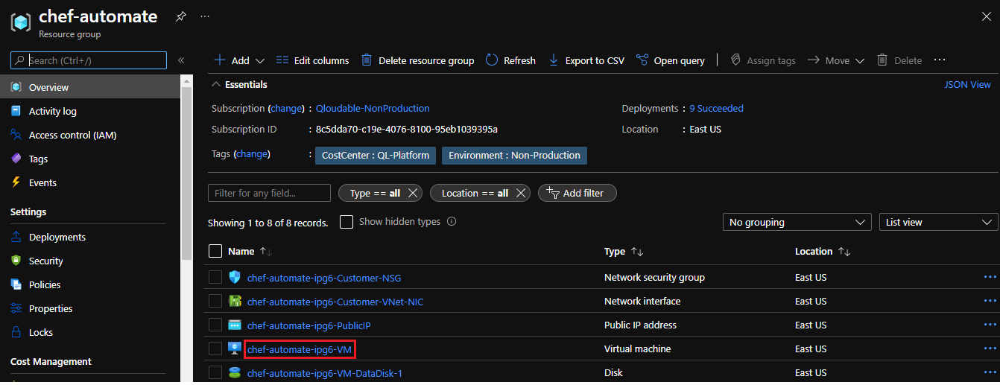

- **Copy the `Public IP` to ssh into VM

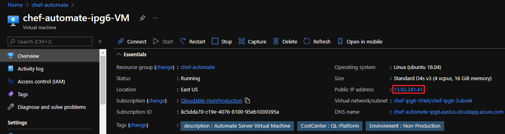

- **SSH into the Chef Automate VM as shown**

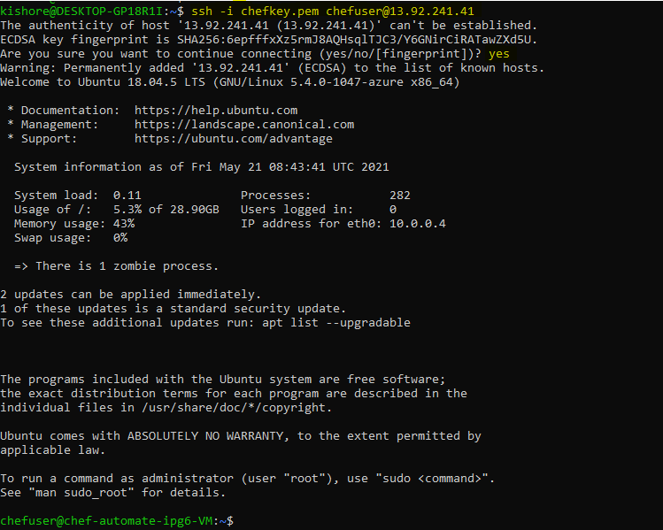

- **Execute the below command to get the Chef Automate `URL` and `login credentials`**

```bash
sudo cat /root/automate-credentials.toml
```

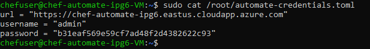

- **Open your favorite browser and Access the Chef Automate URL and click on Advanced and continue as shown below**

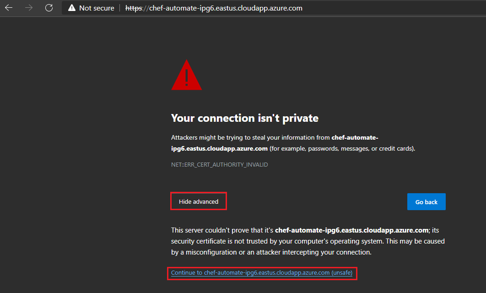

- **Enter your username, Password and click on Sign In to Access Chef Automate WebUI**

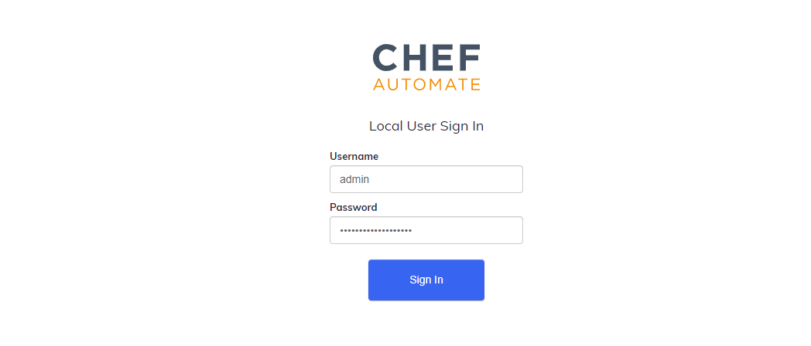

- **Fill the required details and click on Register**

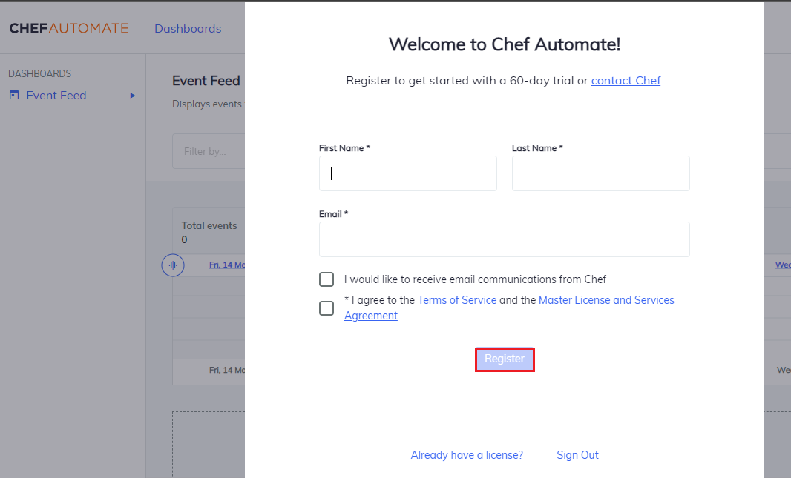

- **Congratulations: Here is the Chef Automate WebUI you can play around with CHEF**

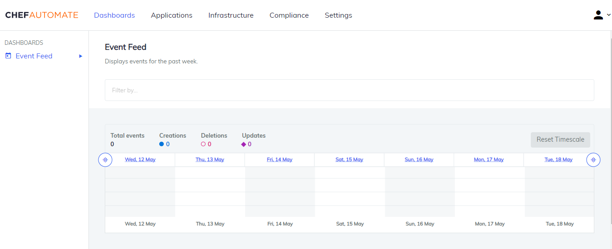
